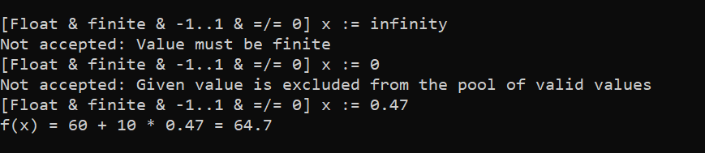

# Console Prompts

A small library to take user input in a console with some exception handling and fluent syntax.

## Features

- User input queries
- Input restrictions (e.g. numeric range, string length, path to an existing file)
- Invalid input handling
- Prompt styling
- Support for `IParsable`

## Usage

Use the `Prompt` class to create a query with one of the `For` methods. Add limits to the query with fluent syntax and `Display` the query to the user.

```csharp
int userAge = Prompt.For<int>("Your age").NoLessThan(1).Display();
const int drinkingAge = 21;

if (userAge >= drinkingAge)
{
	Console.WriteLine("You are of drinking age!");
}
else
{
	Console.WriteLine("Sorry, you can't have a drink.");
}
```


### Styling

The way prompts are displayed can be changed with `PromptStyler` class.

```csharp
PromptStyler.PromptFormat = "[{1}] {0} = ";
PromptStyler.InvalidInputFormat = "I can't accept that: {0}";
PromptStyler.HintLevel = PromptHintLevel.Verbose;

Console.WriteLine("f(x) = 60 + 10x");

float x = Prompt
	.For<float>("x")
	.ForceFinite()
	.OfRange(0, 1)
	.AddHint("real", PromptHintLevel.Verbose)
	.Display();

Console.WriteLine($"f(x) = 60 + 10 * {x} = {60 + 10 * x}");
```



See [Demo Project](./src/Rephidock.ConsolePrompts.Demo) for some other examples.

## Installation

### NuGet

To be uploaded. Please refer to the [manual download](#Manual-Download) section.

### Manual download

1. Open the [Releases](https://github.com/Rephidock/Rephidock.ConsolePrompts/releases) page.
2. Download the `.dll`.
3. (Optional, Recommended) Also download the `.xml` file of the same release.

   The `.xml` file contains documentation and should be placed in the same directory as the `.dll` for hints to appear in an IDE. 
   
4. Add the dependency in your `.csproj` file via IDE or manually:
   ```xml
   <ItemGroup>
     <Reference Include="Rephidock.ConsolePrompts">
       <HintPath>Relative\Path\To\Rephidock.ConsolePrompts.dll</HintPath>
     </Reference>
   </ItemGroup>
   ```
